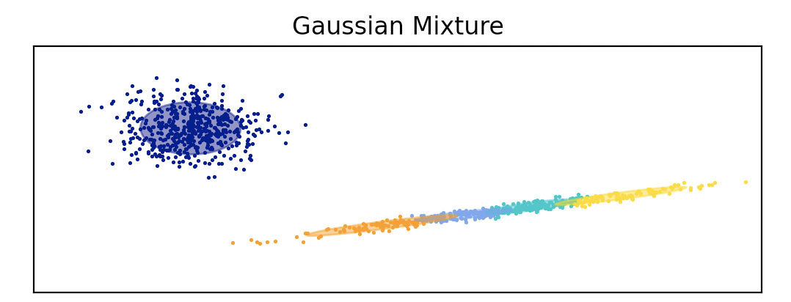
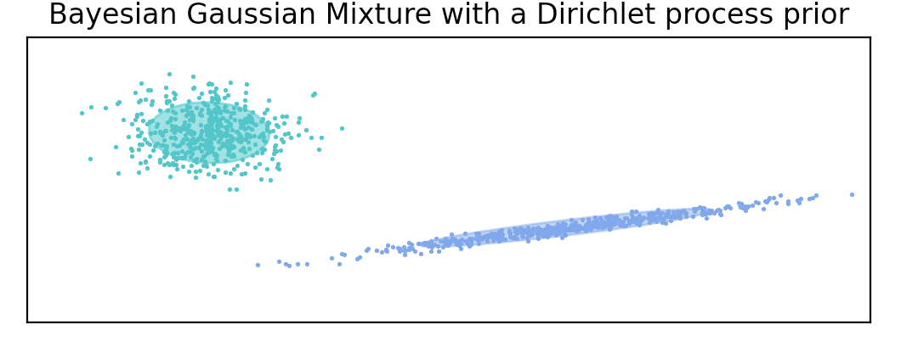
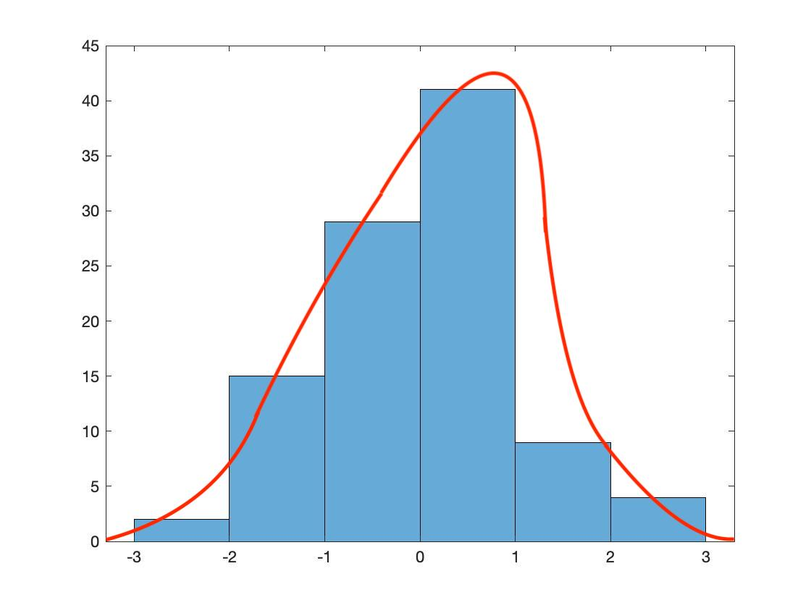
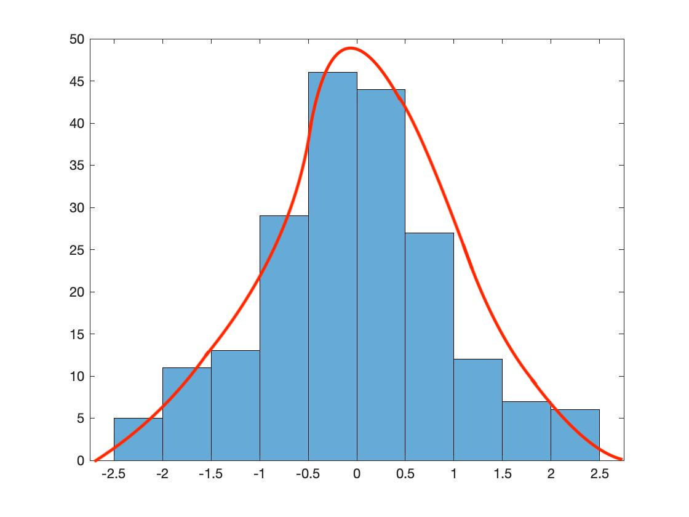
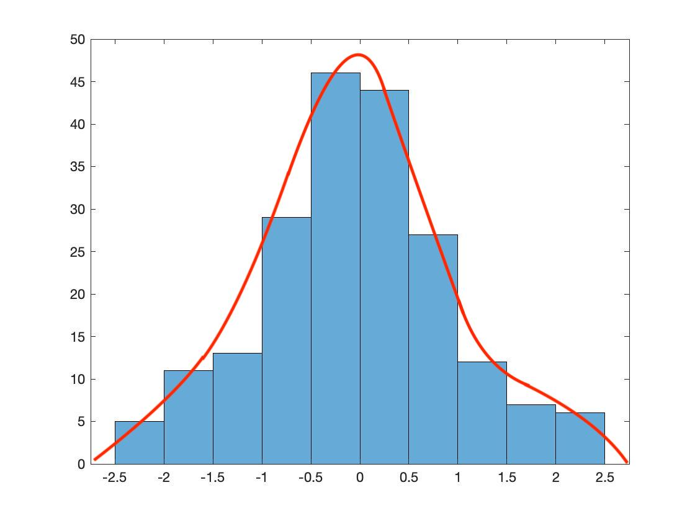

# EECS738_Project01 - Probably Interesting Data

## Distribution estimation
1. Set up a new git repository in your GitHub account
2. Pick two datasets from https://www.kaggle.com/uciml/datasets
3. Choose a programming language (Python, C/C++, Java)
4. Formulate ideas on how machine learning can be used to model distributions within the dataset
5. Build a heuristic and/or algorithm to model the data using mixture models of probability distributions programmatically
6. Document your process and results
7. Commit your source code, documentation and other supporting files to the git repository in GitHub

## Datasets
#### Mushroom Classification
Context
Although this dataset was originally contributed to the UCI Machine Learning repository nearly 30 years ago, mushroom hunting (otherwise known as "shrooming") is enjoying new peaks in popularity. Learn which features spell certain death and which are most palatable in this dataset of mushroom characteristics. And how certain can your model be?

Content
This dataset includes descriptions of hypothetical samples corresponding to 23 species of gilled mushrooms in the Agaricus and Lepiota Family Mushroom drawn from The Audubon Society Field Guide to North American Mushrooms (1981). Each species is identified as definitely edible, definitely poisonous, or of unknown edibility and not recommended. This latter class was combined with the poisonous one. The Guide clearly states that there is no simple rule for determining the edibility of a mushroom; no rule like "leaflets three, let it be'' for Poisonous Oak and Ivy.

Time period: Donated to UCI ML 27 April 1987
Inspiration
What types of machine learning models perform best on this dataset?
Which features are most indicative of a poisonous mushroom?

#### Zoo Animal Classification
This dataset consists of 101 animals from a zoo.
There are 16 variables with various traits to describe the animals.
The 7 Class Types are: Mammal, Bird, Reptile, Fish, Amphibian, Bug and Invertebrate

The purpose for this dataset is to be able to predict the classification of the animals, based upon the variables.
It is the perfect dataset for those who are new to learning Machine Learning.

zoo.csv
Attribute Information: (name of attribute and type of value domain)

animal_name: Unique for each instance
hair Boolean
feathers Boolean
eggs Boolean
milk Boolean
airborne Boolean
aquatic Boolean
predator Boolean
toothed Boolean
backbone Boolean
breathes Boolean
venomous Boolean
fins Boolean
legs Numeric (set of values: {0,2,4,5,6,8})
tail Boolean
domestic Boolean
catsize Boolean
class_type Numeric (integer values in range [1,7])

## Mixture Models

### Gaussian Mixture models
A Gaussian mixture model is a probabilistic model that assumes all the data points are generated from a mixture of a finite number of Gaussian distributions with unknown parameters. One can think of mixture models as generalizing k-means clustering to incorporate information about the covariance structure of the data as well as the centers of the latent Gaussians.

### Variational Bayesian Gaussian Mixture models
Variational inference is an extension of expectation-maximization that maximizes a lower bound on model evidence (including priors) instead of data likelihood. The principle behind variational methods is the same as expectation-maximization (that is both are iterative algorithms that alternate between finding the probabilities for each point to be generated by each mixture and fitting the mixture to these assigned points), but variational methods add regularization by integrating information from prior distributions.

## ideas
1. For Mushroom dataset, I want to build probability distributions to check "Safe to eat or deadly poison?"

2. For Zoo dataset, I want to build probability distributions to check "what type class are they?"

## Results
#### Mushrooms Dataset
GMM:

VBGMM:

#### Zoo Dataset
GMM:

VBGMM:

